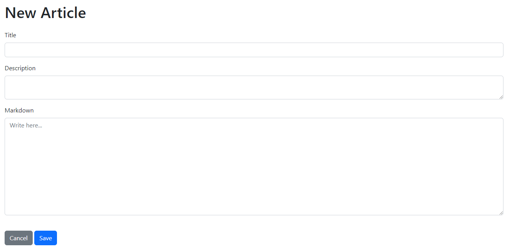
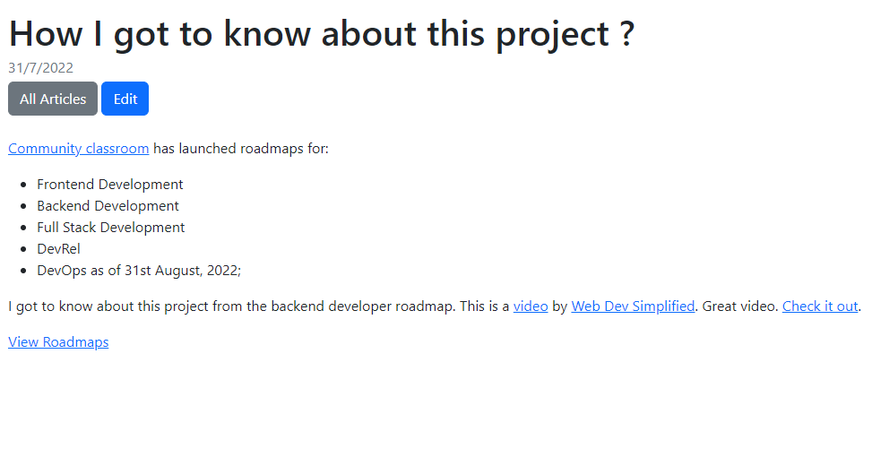
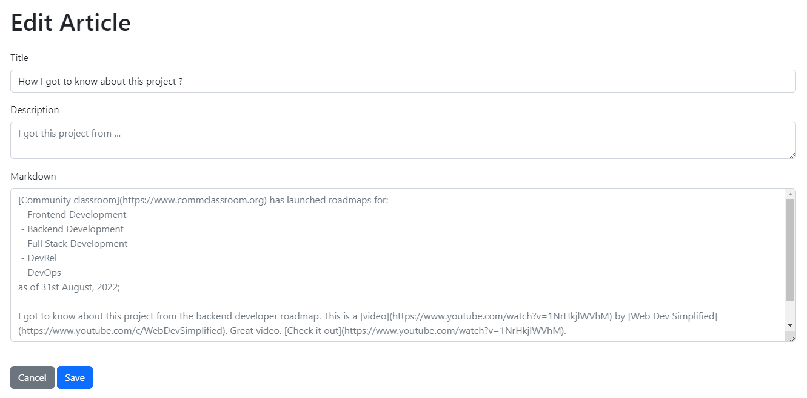

# Markdown Blog

### Tech Stack

- Node JS
- Express JS
- MongoDB
- EJS

### Requirements

- MongoDB Compass needs to be installed

### How to run ?

- Clone this repo in your local system
- Open the folder and run `npm install` in the terminal to install all dependencies
- Run `npm start`
- Open `localhost:5000` in browser to view the project

### Screenshot

